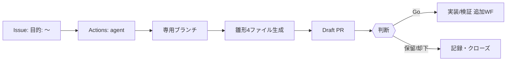

# project_log_2025-08-16.md（エージェント導入ログ／運用資産）

## PCFミニ
目的: ここまでの導入・障害・修正・運用ルールを「誰でも再現できる」形で記録する  
成果物: docs/project_log_2025-08-16.md（本ファイル）  
DoD: 新規メンバーが本書だけでDraft PR自動生成まで到達できる  
Test: 本書の手順通りにIssue→Draft PRが自動作成される

参照: latest.md, latest.json, chat_history_full.md, chat_history_full.jsonl（不足は[UNKNOWN]で明示）  
禁止: main直編集、無根拠の推測、既存ファイルの上書き

---

## 1. タイムライン（抜粋）
- 2025-08-16（JST）: GitHubリポ `kazu-4728/gpt` にてエージェント導入を開始。  
- `.github/workflows` ではなく `github/workflows` に置いたため**未検出**。→ 正しいパスへ配置して解消。  
- `agent_poc.yml` を追加し、新規Issueで**自動コメント**が付くことを確認（PoC合格）。  
- `agent.yml` を追加するも YAML 構文（Here-Doc行の**インデント不足**）で失敗。→ インデント修正で通過。  
- `Create Draft PR` で **「ActionsにPR作成権限なし」**エラー。→ Settings→Actions→General で  
  **Workflow permissions: Read & write** ＋ **Allow Actions to create and approve PRs** を有効化し解消。  
- Draft PRが自動生成され、雛形4ファイル（TASTE/PRFAQ/DECISION/NEXT）がブランチに出力されることを確認。  
- READMEに運用手引きを反映（入口化）。

---

## 2. いま動いている“自動化”
- **Issue→Draft PR（全自動）**: 本文に `目的:`（全角/半角可）or ラベル `agent` → 専用ブランチ＋雛形4ファイル生成 → **Draft PR起票**。  
- **PoC応答**: 新規Issueに自動コメント（起動確認）。  
- **手動Run**: Actions→`agent`→Run から `purpose` 入力で直接Draft PR化。

> 雛形4ファイル: `TASTE.md`, `PRFAQ_1pager.md`, `DECISION_MEMO.md`, `next_actions_v1.md`

---

## 3. インシデントと恒久対策（DIFF-5）
### 3.1 検出されない
- **Before**: `github/workflows`（先頭ドット欠落）  
- **After**: `.github/workflows` に配置  
- **What**: ディレクトリ修正（検出パス）  
- **Why**: Actionsは **`.github/workflows` 配下のみ**を監視するため  
- **Next**: ファイル追加時は必ず**main**上に置く（古いIssueでは起動しない点も注意）

### 3.2 YAMLエラー
- **Before**: Here-Doc本文のインデントが `run: |` 下より浅く、`- T1:` 等がYAML解釈され失敗  
- **After**: Here-Doc本文と `EOF` を**同じ段**へ揃え修正  
- **What**: `Scaffold files` ステップのインデント統一  
- **Why**: YAMLパースを回避し、シェルとして正しく解釈させるため  
- **Next**: モバイル貼付時は**スペース2**の段差を維持

### 3.3 PR作成不可
- **Before**: `GITHUB_TOKEN` が Read-only、PR作成が禁止  
- **After**: Settings→Actions→General: **Read & write** と **Allow Actions to create/approve PRs** をON  
- **What**: リポ設定変更（権限昇格）  
- **Why**: `peter-evans/create-pull-request` がPR作成に `pull-requests: write` を要するため  
- **Next**: 将来ポリシー変更に備え、必要に応じて **PAT運用**へ差替（`token: ${{ secrets.PAT_TOKEN }}`）

---

## 4. 運用フロー（図解）

---

## 5. 使い方（誰でもできる最短手順）
1) **Issues→New issue** を開く  
2) 本文の先頭に **この1行**：`目的: （やらせたいことを1行）`  
3) 数十秒で **Draft PR** が現れ、4ファイルが入っていることを確認  
4) `PRFAQ_1pager.md` を **3〜6行**だけ埋め、**Go/保留/却下**を決める

---

## 6. 将来の拡張（設計済・任意実装）
- **/slides**: PRコメント `/slides` → `PRFAQ_1pager.md` から **slides.pptx/pdf** 自動生成（Artifacts添付 or `docs/` 反映）  
- **/go / /kill**: コメント指令でドラフト解除・即クローズ  
- **PRFAQ自動下書き**: APIキーがある場合のみON（LLMで骨子生成）  
- **READ健全性**: 定期スモーク（メタ情報の健全性をJSON出力）

---

## 7. 役割とルール
- **あなた**: 編集長（Tasteで○×）  
- **エージェント**: 手足（形にし、並べる）  
- **WIP=1** / **本流はPR経由** / **却下も資産**（`DECISION_MEMO.md` に1行理由）。

---

## 8. 用語（JX-15: 短注釈）
- **GitHub Actions**: GitHub上の自動実行基盤（イベント駆動でジョブを実行）  
- **Draft PR**: 下書きPull Request（マージ不可の検討用）  
- **Workflow permissions**: `GITHUB_TOKEN` の権限設定（Read-only / Read&Write とPR作成許可）  
- **Artifact**: ワークフローの生成物をダウンロード保管する仕組み  
- **スラッグ化**: 文字列を英数・ハイフンに正規化してブランチ名等に使える形に変換

---

## 9. 変更履歴
- 2025-08-16 02:09:09 UTC+09:00: 初版作成（エージェント導入ログ／運用資産化）
